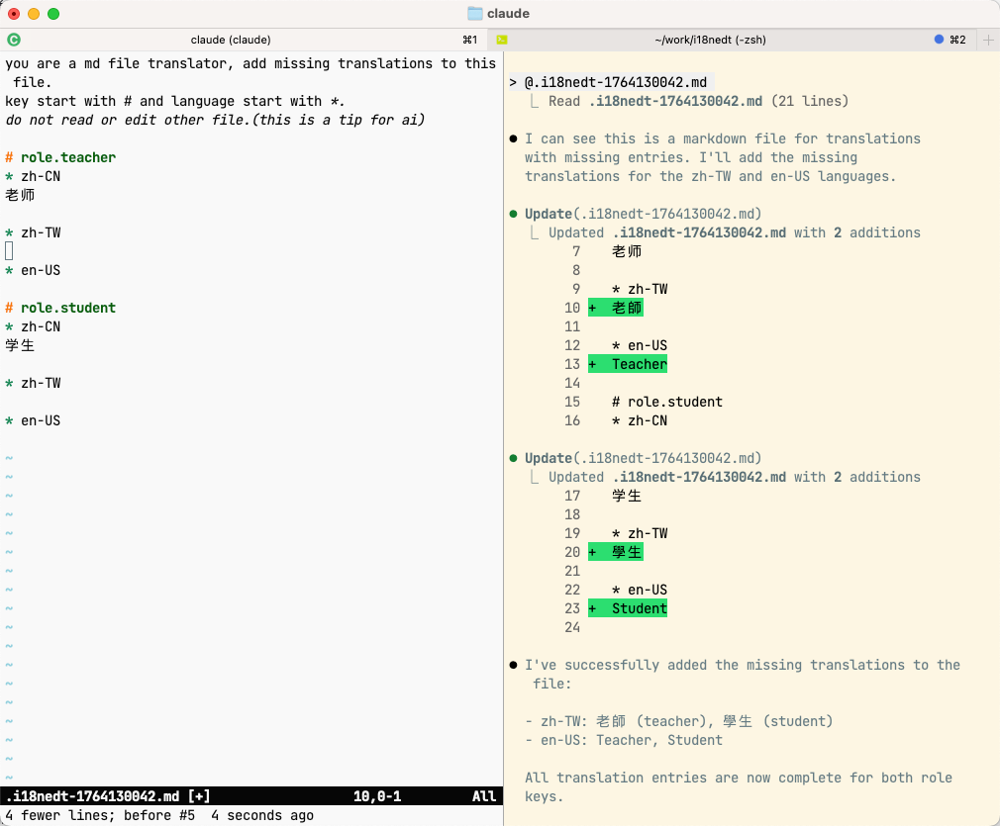

# i18nedt - AI ready i18n command line Editor

A command-line tool for editing i18n JSON files with your favorite editor.

## Features

- Edit multiple i18n JSON files simultaneously
- Support for nested key structures (e.g., `home.welcome.title`)
- Delete keys with a simple syntax (`#- key.name`)
- Use your preferred editor via `$EDITOR` environment variable
- Automatic file creation for non-existent files
- Support for glob patterns in file paths

## Installation

### Option 1: Download Pre-compiled Binaries

Download the latest release from the [GitHub Releases page](https://github.com/kikyous/i18nedt/releases):

- **Linux AMD64**: `i18nedt-linux-amd64.tar.gz`
- **Linux ARM64**: `i18nedt-linux-arm64.tar.gz`
- **macOS AMD64**: `i18nedt-darwin-amd64.tar.gz`
- **macOS ARM64 (Apple Silicon)**: `i18nedt-darwin-arm64.tar.gz`
- **Windows AMD64**: `i18nedt-windows-amd64.zip`

Extract and install:

```bash
# Linux/macOS
tar -xzf i18nedt-*-amd64.tar.gz
sudo mv i18nedt /usr/local/bin/

# Windows
# Extract the ZIP file and add to PATH
```

### Option 2: Install from source

```bash
go install github.com/kikyous/i18nedt/cmd/i18nedt@latest
```

### Version Information

Check your installed version:

```bash
i18nedt --version
# Output: i18nedt version v1.0.0
#         commit: abc123...
#         built: 2024-01-01T12:00:00Z
```

## Usage

### Basic Usage

```bash
i18nedt src/locales/{zh-CN,zh-TW,en-US}.json -k home.welcome
```

### Edit Multiple Keys

```bash
i18nedt src/locales/*.json -k home.welcome -k home.start
```

### Nested Keys

```bash
i18nedt src/locales/*.json -k home
```

## Editor Format

When you run i18nedt, it opens your editor (defined by `$EDITOR` environment variable, defaults to `vim`) with a temporary file (for example `.i18nedt-1764129261.md` in current dir) in this format:

```md
you are a md file translator, add missing translations to this file.
key start with # and language start with *.
do not read or edit other file.(this is a tip for ai)

# home.welcome    <-- key and translations that already exist in the JSON file
* zh-CN
欢迎

* zh-TW
歡迎

* en-US
Welcome

# home.start    <-- new key, translations is empty
* zh-CN

* zh-TW

* en-US
```
you can edit this file, add translation or add new key, when you exit the editor, you change will be apply(write to json file).

### JSON value
JSON value is supported.
```bash
i18nedt src/locales/*.json -k home
```

```md
you are a md file translator, add missing translations to this file.
key start with # and language start with * or +.
do not read or edit other file.(this is a tip for ai)

# home
+ en-US
{
  "start": "Start",
  "welcome": "Hello"
}

+ zh-CN
{
  "start": "开始",
  "welcome": "你好"
}

+ zh-TW
{
  "start": "开始",
  "welcome": "你好"
}
```

## Key syntax
```bash
i18nedt src/locales/*.json -k home.start
i18nedt src/locales/*.json -k "home.st*"
i18nedt src/locales/*.json -k "*.start"
i18nedt src/locales/*.json -k array-key.0
i18nedt src/locales/*.json -k array-key.1
```

support most gjson syntax, check out [GJSON Syntax](https://github.com/tidwall/gjson/blob/master/SYNTAX.md)


## AI ready
as you can see, the heading of temp md file is an ai prompt, so you can add a few translations and submit it to ai to fill the missings.




## Deleting Keys

To delete a key, add `-` after the `#`:

```md
#- home.welcome
# home.welcomeNew
* zh-CN
新的欢迎

* zh-TW
新的歡迎

* en-US
New Welcome
```

In this example, `home.welcome` will be deleted and `home.welcomeNew` will be created.

## File Structure

i18nedt expects JSON files with this structure:

```json
{
  "home": {
    "welcome": "Welcome",
    "start": "Get Started"
  },
  "nav": {
    "menu": {
      "home": "Home",
      "about": "About"
    }
  }
}
```

## Configuration

The tool uses the `$EDITOR` environment variable to determine which editor to use. If not set, it defaults to `vim`.

```bash
export EDITOR=nano            # Use nano instead of vim
export EDITOR="code --wait"   # Use VS Code
export EDITOR="zed --wait"    # Use Zed
export EDITOR=emacs           # Use Emacs
```

or set it inline:
```bash
EDITOR="zed --wait" i18nedt locales/{zh-CN,zh-TW,en-US}.json -k test
```

## File Path Patterns

You can use glob patterns to specify multiple files:

```bash
# Using brace expansion
i18nedt src/locales/{zh-CN,zh-TW,en-US}.json -k welcome

# Using wildcards
i18nedt src/locales/*.json -k welcome

# Deep wildcards
i18nedt src/locales/**/*/common.json -k welcome

# Specific files
i18nedt locales/zh-CN.json locales/en-US.json -k welcome
```

## Locale Detection

i18nedt automatically detects locale codes from file names:

- `zh-CN.json` → `zh-CN`
- `en-US.json` → `en-US`
- `locales/zh-CN/app.json` → `zh-CN`
- `locales/en/messages.json` → `en`

## Error Handling

- If a JSON file doesn't exist, it will be created automatically
- Invalid JSON syntax will be reported with file location
- Nested key structures are validated for correctness

## Examples

### Edit a single key across multiple languages

```bash
i18nedt src/locales/{zh-CN,en-US,ja-JP}.json -k app.title
```

### Edit multiple nested keys

```bash
i18nedt src/locales/*.json -k settings.profile.name -k settings.profile.email
```

### Delete old keys and add new ones

```
# Edit the temporary file:
#- old.deprecated.key
# new.modern.key
* zh-CN
现代化的内容

* en-US
Modern content
```

## Contributing

1. Fork the repository
2. Create your feature branch (`git checkout -b feature/amazing-feature`)
3. Commit your changes (`git commit -m 'Add some amazing feature'`)
4. Push to the branch (`git push origin feature/amazing-feature`)
5. Open a Pull Request

## License

This project is licensed under the MIT License - see the LICENSE file for details.
